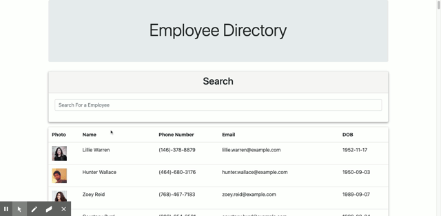

# Employee Directory


## _Links_

Deployed URL: https://employee-directory-kp.herokuapp.com/

Github Code URL: https://github.com/kpegeder/user_directory

## Description

An employee directory with react. The ability to sort employees by first name alphabetically and search by first or last name.

## Table of Contents

- [Installation](#installation)
- [Usage](#usage)
- [Test](#test)
- [License](#license)
- [Questions](#questions)

## Installation

To install necessary dependencies, run the following command:

```
npm i
```

## Usage

Instructions to use the program locally

1. Run npm start



To watch a [video](https://drive.google.com/file/d/1wkKq5EIsWFiZmj973BaV2a_SsRkw7n6F/view?usp=sharing) of the demo

## Test

To run tests, run the following command:

```
npm run test
```

## Contributing

[Kalen Pegeder](https://github.com/kpegeder)

## License

Licensed under the MIT license.

## Questions

If you have any additional questions about the applictaion, you can contact through [email](mailto:k.pegeder@gmail.com).
You can see more of my work on [GitHub](https://github.com/kpegeder).
